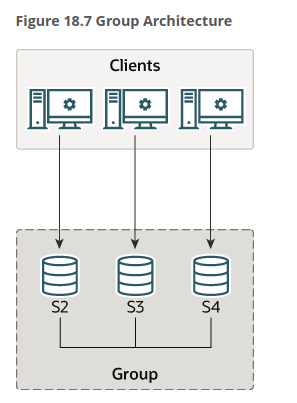

Table of Contents

- [Main Ideas](#main-ideas)
- [Replication on VirtualBox (Alma Linux)](#replication-on-virtualbox-alma-linux)
  - [Replication Technique with Binay Log File Position](#replication-technique-with-binay-log-file-position)
  - [Group Replication Technique](#group-replication-technique)
    - [Single Primary Mode](#single-primary-mode)
- [Useful links](#useful-links)

## Main Ideas

- We have a `Master` node and a `Slave` node
- When a client inserts data to the `Master` node then, the data should be sent to the `Slave` node
- A client that is reading data from the `Slave` node, can see the same data inserted to the `Master` node
- If we disconnect the `Master` and `Slave` node, then the client that is reading from the `Slave` node, couldn't read the data inserted from the `Master` node

## Replication on VirtualBox (Alma Linux)

### Replication Technique with Binay Log File Position

> [Documentation](https://dev.mysql.com/doc/refman/8.0/en/replication.html) related to this technique

1. We need to create two virtual machines
   - `Master` node
   - `Slave` node

2. We need to install `MySQL` on both virtual machines

```bash
sudo dnf install mysql mysql-server -y
```

3. Start, enable and check the status of `MySQL` on both virtual machines

```bash
systemctl start mysqld
systemctl enable mysqld
systemctl status mysqld
```

4. Configure `MySQL` on the `Master` and `Slave` node

```bash
mysql_secure_installation
```

5. Set a global `server_id` variable on both virtual machines
  - Run these commands on the master node
```bash
mysql -u root -p
```

```sql
SET GLOBAL server_id=1;
```

  - Run these commands on the slave node

```bash
mysql -u root -p
```

```sql
SET GLOBAL server_id=2;
```

- To see the value of the `server_id` variable

```sql
SELECT @@server_id;
```

6. Set a global `log_bin` variable on both virtual machines

```bash
# Master node
mysql -u root -p
```

```sql
SET GLOBAL log_bin=ON;
```

```bash
# Slave node
mysql -u root -p
```

```sql
SET GLOBAL log_bin=ON;
```

7. Create a user for replication on the `Master` node
   - Each replica connects to the source using a MySQL user name and password, so there must be a user account on the source that the replica can use to connect.

```sql
CREATE USER 'repl'@'%' IDENTIFIED BY '1850ABc';
GRANT REPLICATION SLAVE ON *.* TO 'repl'@'%';

-- % means that the user can connect from any host
-- *.* means that the user can connect to any database
```

8. Start a session, flushing all tables and blocking any write statements

```sql
-- Master node
FLUSH TABLES WITH READ LOCK;
```

9. Show the status of the `Master` node

```sql
SHOW MASTER STATUS\G
```


> **Note:** If you already have data on the source and want to use it to synchronize the replica, you need to create a data snapshot to copy the data to the replica. 

10. Setting the Source Configuration on the Replica

```sql
-- Slave node
-- Before MySQL 8.0.23:
mysql> CHANGE MASTER TO
    ->     MASTER_HOST='source_host_name',
    ->     MASTER_USER='replication_user_name',
    ->     MASTER_PASSWORD='replication_password',
    ->     MASTER_LOG_FILE='recorded_log_file_name',
    ->     MASTER_LOG_POS=recorded_log_position;

-- Or from MySQL 8.0.23:
CHANGE REPLICATION SOURCE TO
  SOURCE_HOST='192.168.100.73',
  SOURCE_USER='repl',
  SOURCE_PASSWORD='1850ABc',
  SOURCE_LOG_FILE='binlog.000002',
  SOURCE_LOG_POS=3953,
  GET_SOURCE_PUBLIC_KEY=1;
```

11. Update firewall rules on both virtual machines

```bash
firewall-cmd --permanent --add-service=mysql
firewall-cmd --permanent --add-port=3306/tcp
firewall-cmd --reload
```

### Group Replication Technique

#### Single Primary Mode



1. We need to create al least 3 virtual machines
   - `sql-ONE` node
   - `sql-TWO` node
   - `sql-THREE` node

> **Note:** We need al least 3 virtual machines because of the [Fault Tolerance](https://dev.mysql.com/doc/refman/8.0/en/group-replication-fault-tolerance.html)

2. Install `mysql` and `mysql-server` 

```bash
dnf install mysql mysql-server -y
```

3. Start and enable the service

```bash
systemctl start mysqld
systemctl enable mysqld
```

4. Create secure installation on all virtual machines

```bash
mysql_secure_installation
```

5. Disable the `SELinux` on all virtual machines

```bash
setenforce 0
```

6. Desactivate firewalld service

```bash
systemctl stop firewalld
systemctl disable firewalld
```

Or just add mysql service and open ports to receive requests

```bash
firewall-cmd --permanent --add-service=mysql
firewall-cmd --permanent --add-port=3306/tcp # For MySQL
firewall-cmd --permanent --add-port=33061/tcp # For Group Replication
firewall-cmd --reload
```

7. We have to edit the `/etc/my.cnf.d/mysql-server.cnf` file on all virtual machines with the following content

```bash
[mysqld]
skip_name_resolve=ON # To avoid DNS resolution
server_id=1 # Change the server_id for each node
disabled_storage_engines="MyISAM,BLACKHOLE,FEDERATED,ARCHIVE,MEMORY" # Disable the storage engines that you don't need
datadir=/var/lib/mysql # The directory where the data will be stored
socket=/var/lib/mysql/mysql.sock # The socket file
log-error=/var/log/mysql/mysqld.log # The log file
pid-file=/run/mysqld/mysqld.pid # The pid file
gtid_mode=ON # Enable the GTID mode
enforce_gtid_consistency=ON # Enable the GTID consistency
plugin_load_add='group_replication.so' # Load the group replication plugin
group_replication_group_name="5add9b42-775c-11ee-be2f-080027f362da" # The group name
group_replication_start_on_boot=off # Don't start the group replication on boot
group_replication_local_address= "192.168.100.79:33061" # The local address of the node
group_replication_group_seeds= "192.168.100.79:33061,192.168.100.80:33061,192.168.100.81:33061" # The address of the other nodes
```

And then restart the `mysqld` service

```bash
systemctl restart mysqld
```

> **Note:** See the information related to the variables [here](https://dev.mysql.com/doc/refman/8.0/en/group-replication-configuring-instances.html)

8. We have to create a user for the replication on all virtual machines

```bash
mysql -u root -p
```

```sql
-- Disable the log
SET SQL_LOG_BIN=0;

CREATE USER 'repl'@'%' IDENTIFIED WITH mysql_native_password BY '1850ABc';
GRANT REPLICATION SLAVE ON *.* TO 'repl'@'%';
GRANT CONNECTION_ADMIN ON *.* TO 'repl'@'%';
GRANT BACKUP_ADMIN ON *.* TO 'repl'@'%';
GRANT GROUP_REPLICATION_STREAM ON *.* TO 'repl'@'%';
FLUSH PRIVILEGES;

-- Enable the log
SET SQL_LOG_BIN=1;
```

> **Note:** This user must be the same on all nodes. You might want create some users to access the database in a secure way. Do it! Read the documentation [here](https://dev.mysql.com/doc/refman/8.0/en/group-replication-prerequisites.html)

9. When you have created the replication user, you must supply the user credentials to the server for use with distributed recovery. You can do this by setting the user credentials as the credentials for the group_replication_recovery channel

```sql
CHANGE REPLICATION SOURCE TO 
  SOURCE_USER='repl',
  SOURCE_PASSWORD='1850ABc' FOR CHANNEL 'group_replication_recovery';
```

**Note:** You must run this command on all nodes
> Read the documentation [here](https://dev.mysql.com/doc/refman/8.0/en/group-replication-user-credentials.html)

10.  Check the plugins for `group_replication`

```sql
SHOW PLUGINS;
```

You must check that the `group_replication` plugin is installed otherwise you must install it

```sql
INSTALL PLUGIN group_replication SONAME 'group_replication.so';
```

> Read the documentation [here](https://dev.mysql.com/doc/refman/8.0/en/group-replication-launching.html)

11. Bootstrap the group replication. Ensure that you run these commands on the primary node

```sql
SET GLOBAL group_replication_bootstrap_group=ON;
START GROUP_REPLICATION;
SET GLOBAL group_replication_bootstrap_group=OFF;
```

- If you are providing the credentials for the group_replication_recovery channel (Mysql 8.0.23 or later)

```sql
SET GLOBAL group_replication_bootstrap_group=ON;
START GROUP_REPLICATION USER='repl', PASSWORD='1850ABc';
SET GLOBAL group_replication_bootstrap_group=OFF;
```

12. Check the status of the group replication

```sql
SELECT * FROM performance_schema.replication_group_members;
```

13. To add more instances to the group, you must start the MySQL server on each instance and configure them to join the group

> Read de docs [here](https://dev.mysql.com/doc/refman/8.0/en/group-replication-adding-instances.html)

You just need to run the following command on the other nodes

```sql
START GROUP_REPLICATION;
```

14. Remember that always you need to run the following command on the primary node to start the group replication

  ```sql
  SET GLOBAL group_replication_bootstrap_group = ON;
  START GROUP_REPLICATION;
  SET GLOBAL group_replication_bootstrap_group = OFF;
  ```

  - For example whe you shutdown all the nodes and you want to start the group replication again

**GENERAL NOTE:** You may need to `bind ip addresses` to have the mysql group replication working properly. You can achieve this editing the `/etc/hosts` file on all nodes

```bash
x.x.x.x MACHINE-HOSTNAME
y.y.y.y MACHINE-HOSTNAME
z.z.z.z MACHINE-HOSTNAME
```

## Useful links

- https://chrisshennan.com/blog/fixing-authentication-plugin-cachingsha2password-cannot-be-loaded-errors
- [Setting up Binay Log File Position Based Replication](https://dev.mysql.com/doc/refman/8.0/en/replication-howto.html)
- https://www.youtube.com/watch?v=mLIT5H6zUJo